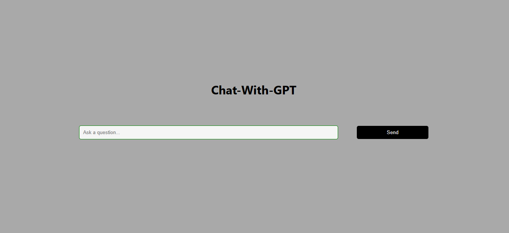

<h1 align="center">Chat-With-GPT </h1>



Welcome to Chat-With-GPT ! This project allows users to engage in interactive and dynamic conversations with an AI language model powered by OpenAI's GPT-3.5. It's built using ReactJS and requires an OpenAI API key to function effectively.

## Table of Contents
- [Introduction](#introduction)
- [Installation](#installation)
- [Usage](#usage)
- [Configuration](#configuration)
- [Limitations](#limitations)
- [Contributing](#contributing)
- [License](#license)

## Introduction
The Chat-With-GPT project enables you to experience cutting-edge AI language capabilities through OpenAI's GPT-3.5 model. Users can have natural and dynamic conversations with the AI by entering messages in the chat interface.

## Installation
To set up the project locally, follow these steps:

1. Clone the repository: 
   ```
   git clone https://github.com/your-username/chat-with-gpt.git
   ```

2. Navigate to the project directory:
   ```
   cd chat-with-gpt
   ```

3. Install dependencies:
   ```
   yarn install
   ```

## Usage
Before running the application, make sure you have obtained an API key from OpenAI. If you don't have one, sign up for an account and generate an API key.

To run the project locally, use the following command:
```
OPENAI_API_KEY=your_openai_api_key npm start
```
Replace `your_openai_api_key` with the actual API key you obtained from OpenAI.

Once the development server is up and running, open your web browser and navigate to `http://localhost:3000` to access the Chat with GPT application.

## Configuration
You can customize certain aspects of the Chat-With-GPT project by modifying the configuration file located at `src/openai.js`. Here, you can change settings related to the AI language model, chat interface, and more.

## Limitations
Please be aware of the following limitations of this project:

1. **OpenAI API Usage:** The project relies on the OpenAI API for language processing. Ensure that you have sufficient API credits to handle your usage.

2. **Internet Connection:** Since the project utilizes the OpenAI API, an active internet connection is required to access the AI language model.

3. **Response Time:** The response time of the AI model may vary depending on the complexity of the conversation and the API load.

4. **Security:** Avoid sharing your OpenAI API key publicly or including it in version control systems, as it could lead to unauthorized usage.

## Contributing
We welcome contributions to enhance the project! If you find any issues or have ideas for improvements, please submit a pull request. Before making significant changes, it's best to open an issue for discussion.

When contributing to this project, please ensure that your code adheres to the existing code style and is well-documented.

## License
The Chat-With-GPT project is licensed under the [MIT License](LICENSE).

---

Thank you for using Chat-Qith-GPT! If you have any questions or need support, feel free to contact the project maintainers or create an issue on the repository. Happy chatting with AI!
